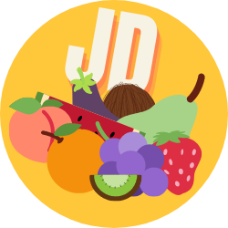

#  Jedz Dobrze 

Aplikacja mobilna zbudowana za pomocą frameworku [Google Flutter](https://flutter.dev/)
na hackaton **Hack Heroes *2020***

## Autorzy

Drużyna **HoldIT**
* Antoni Simka <antonisimka.8@gmail.com>
* Łukasz Dragon <lukasz.b.dragon@gmail.com>
* Kacper Olszowski <kacperolszowski25@gmail.com>

## Zasada działania

Aplikacja łączy się ze stworzoną przez nas bazą danych
zawierającą najczęstsze składniki produktów
spożywczych oraz wszystkie dodatki do żywności według [EFSA](https://www.efsa.europa.eu/).
Użytkownik może:
1. Zeskanować składniki z produktu spożywczego przy użyciu aparatu telefonu lub wybierając zdjęcie z galerii
2. Wyszukać składnik bezpośrednio w bazie

Aplikacja automatycznie odczytuje tekst składników ze zdjęć przy użyciu technologii [OCR](https://en.wikipedia.org/wiki/Optical_character_recognition) *(Optical Character Recognition)*, zaimplementowanej za pomocą nauczania maszynowego [Google ML](https://developers.google.com/ml-kit/) *(Google Machine Learning Kit)*

Po zeskanowaniu użytkownik otrzymuje składniki w formie tabelki, z opisem każdego z nich i stopniem zagrożenia dla zdrowia, jaki reprezentuje. Aplikacja kalkuluje również średnią ogólną ocenę produktu dla szybkiego sprawdzania czy dany produkt jest zdrowy czy szkodzi zdrowiu.

## Strona internetowa
Strona internetowa z linkiem do pobrania znajduje się tutaj:
https://skelebot.github.io/jedz-dobrze/

### [Wszystkie wersje aplikacji](https://github.com/Skelebot/jedz-dobrze/releases)